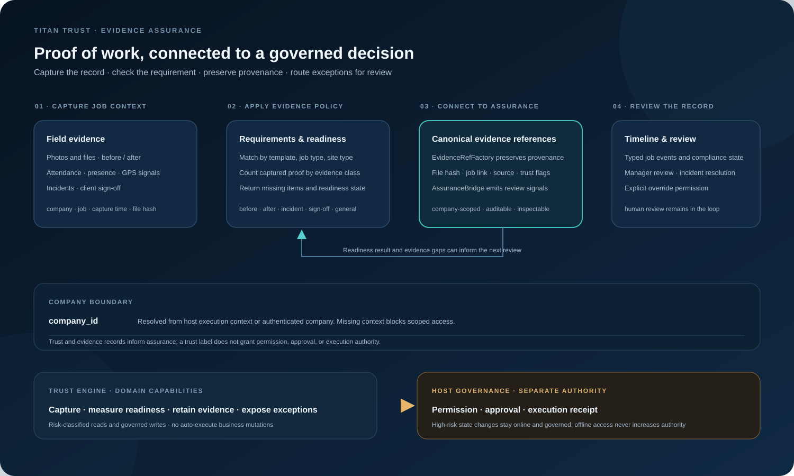

<p align="center">
  
</p>

<h1 align="center">Titan Trust Engine</h1>

<p align="center"><strong>Turn field activity into traceable proof, clear evidence requirements, and accountable review.</strong></p>

<p align="center">
  <a href="#architecture">Architecture</a> ·
  <a href="#capabilities">Capabilities</a> ·
  <a href="#governance-and-boundaries">Governance</a> ·
  <a href="#installation">Installation</a>
</p>

[](https://github.com/Masterleeaus/Trust-Engine/actions/workflows/trust-signal-eval.yml)

---

## Evidence assurance for work performed in the real world

Titan Trust is a PHP/Laravel extension that adds an evidence and assurance layer to job-based operations. It helps teams capture proof at the point of work, check it against configured requirements, preserve the related context, and route exceptions for review.

The package connects **photos and files, job attendance, client sign-off, incidents, evidence rules, and job timelines** to the host platform’s company context and Titan Zero Assurance services. Evidence can be referenced with its company, job, file, hash, capture, and trust metadata intact.

**The core design principle:** evidence can support an assurance decision, but trust data does not grant action authority. Review, overrides, and other state changes remain behind host permissions and governed capabilities.

## Architecture

<p align="center">
  
</p>

| Layer | Responsibility | Packaged components |
|---|---|---|
| **Capture** | Collect work proof and context at job level. | Evidence uploads, capture metadata, GPS presence and accuracy signals, attendance/presence, incidents, client sign-off. |
| **Evidence policy** | Define what proof is required and show gaps. | Rules scoped by job template, job type, and site type; readiness results for before, after, incident, sign-off, and general evidence. |
| **Assurance bridge** | Normalize proof for the host’s assurance layer. | `EvidenceRefFactory` maps evidence, sign-offs, incidents, and attendance into canonical evidence references; incident signals can be emitted through `AssuranceBridge`. |
| **Audit and review** | Preserve job activity and make exceptions reviewable. | Typed job events and compliance states, a job timeline, manager review, incident resolution, and rule management. |
| **Governed integration** | Expose capabilities to the central workforce and app surfaces. | Company-scoped workforce manifest, risk classes, read/write capability declarations, and authority-neutral interface contributions. |

## Capabilities

### Job evidence capture

- Capture evidence against a job, job item, incident, or site context.
- Store file metadata, original name, MIME type, size, storage location, and SHA-256 hash.
- Preserve who captured the evidence, when it was captured, GPS coordinates, reported accuracy, source, trust level, and trust flags where supplied.
- Configure accepted evidence types and upload limits in the extension configuration. The packaged defaults allow JPEG, PNG, WebP, and PDF with a 25 MB limit.

### Evidence requirements and readiness

Rules can be associated with a job template, job type, or site type. The readiness service selects the most specific matching rule, counts captured evidence by type, and reports what is required, what is present, what is missing, and whether the job meets that rule.

### Presence and attendance signals

The extension records arrival and departure actions and can derive first and last capture times from evidence records. GPS presence and reported accuracy are turned into explicit trust flags and a coarse signal level for review. These are contextual signals; a high signal is not proof that an event is true.

### Client sign-off

Staff can request a time-limited sign-off link. The customer can provide a name, signature image, and notes; the sign-off record and signature file can then be linked into the assurance evidence model. The configured maximum link lifetime is 720 hours.

### Incidents and compliance review

Capture incidents with severity and job context, review open incidents, and resolve them through permission-checked routes. Managers can review compliance and use the explicit override capability where the host grants it. Changes are represented in the host job event and compliance-state model.

### Job audit timeline

Trust writes typed job events and exposes a timeline for job review. The event records use the host’s company, user, team, job, event type, time, severity, message, and metadata fields, allowing the proof trail to sit beside the rest of the job history.

## What makes the design distinctive

- **Requirements are machine-readable:** a job’s evidence policy is selected by matching context, not buried in free-form instructions.
- **Readiness is explainable:** reviewers can see the evidence counts and missing categories behind a readiness result.
- **Provenance travels with proof:** canonical evidence references retain file hashes and job/capture context for downstream assurance.
- **Tenant isolation fails closed:** `company_id` is resolved from the host execution context or authenticated user; missing context blocks scoped reads and writes.
- **Capabilities are separated from roles:** Titan Trust declares what operations it provides; the central workforce remains the source of truth for workforce and role definitions.
- **Offline mode cannot raise authority:** cached read projections can remain available while state-changing actions stay online and governed.
- **Review remains human-governed:** the package can surface evidence and exceptions without turning a trust label into permission to act.

## Governance and boundaries

The extension manifest declares risk-classified capabilities for evidence reads and capture, readiness, timeline, presence evaluation, incident review and resolution, sign-off requests, rules, and compliance review or override. High-risk writes are marked as governed domain writes. The workforce manifest requires fail-closed execution context and receipts; it does not auto-execute business mutations or seed roles into the host.

Titan Trust is an **evidence-assurance component**, not a general-purpose identity-verification product, autonomous permission service, or standalone agent reputation score. Its GPS-based trust level is a small heuristic signal based on location presence and reported accuracy. The consuming assurance and authority layers must interpret evidence in context.

## Repository map

```text
System/                         Domain services, models, controllers, tenancy, assurance bridge
Http/                           Host-compatible review and timeline controllers
Database/                       Menu seeder
database/migrations/            Evidence, sign-off, attendance, incident, and job-schema migrations
resources/views/                Capture, evidence, rules, incidents, sign-off, and review screens
resources/workforce/            Risk-classified workforce capability manifest
resources/interface/            Authority-neutral Titan app surface contributions
routes/                         Extension routes
config/                         Evidence storage, upload, MIME, and sign-off settings
tests/                          Authorization, convergence, and evidence regression checks
archive/                        Original Titan Trust Master v2.1.0 package
assets/                         Original branded banner and architecture infographic
```

## Installation

This repository contains an extension package for the Titan Zero/MagicAI Laravel host, not a standalone Composer application. The extension manifest declares PHP 8+, Laravel 8+, and the host `menu` extension as its direct package requirements. Use the host’s extension installation workflow so its service provider, migrations, and menus are registered.

For an existing compatible host installation, run the extension migration through the host’s module installer. If the host requires the Artisan workflow, clear cached discovery before and after migration:

```bash
php artisan optimize:clear
php artisan module:migrate TitanTrust
php artisan optimize:clear
```

Then open the Trust review, evidence, and incident screens in the host dashboard and verify uploads against the deployment’s configured storage and MIME policy. Back up the database before applying migrations. Review `config/titantrust.php`, `config/jobs-evidence.php`, `extension.json`, and the workforce manifests against the specific host version before enabling governed write capabilities.

### Sign-off storage note

The public client sign-off flow is intentionally token-based and time-limited. In this v2.1.0 package, its controller writes signature images to Laravel’s `public` storage disk. Review public URL exposure and the host’s privacy requirements before enabling the flow for sensitive signatures.

## Reproducible trust-signal evaluation

The deterministic evaluation checks whether the packaged GPS heuristic matches an explicit rubric for missing coordinates, reported accuracy thresholds, provenance flags, and boundary values. It measures this coarse signal behavior only; GPS does not establish attendance or truth.

Evaluated **4 October 2026** against commit `8fc45e70d92065ce134c393c4549472ce0cc9754` with PHP 8.2.34. The corpus contains **32 fixed scenarios**, seed `20261004`, with random sampling disabled (SHA-256: `b0e923ad40cfc76c3537f0123abe4aa230a53c8ed7332353f554459f2837fdd1`).

| Metric | Result |
|---|---:|
| Trust-level mismatches | 0 / 32 |
| Quality-flag mismatches | 0 / 32 |
| High signals with no GPS | 0 / 6 |
| High signals with accuracy over 500 m | 0 / 5 |
| Correct medium signals for 100 m < accuracy <= 500 m | 8 / 8 |
| GPS-present cases missing accuracy that still receive high | 3 / 3 |
| Missing-accuracy cases flagged `no_accuracy` | 3 / 3 |
| Scenario failures | 0 / 32 |
| Illustrative always-high/no-flags baseline output mismatches | 25 / 32 |

The missing-accuracy result is a design diagnostic: these cases carry `no_accuracy`, but the implementation still assigns a high tier when coordinates are present. A high tier is only a coarse signal. The baseline is a deliberately simple bypass control, not a competing product.

Reproduce with one command:

```bash
php scripts/trust-signal-eval.php
```

The test corpus is [`evaluations/trust-signal/scenarios.json`](evaluations/trust-signal/scenarios.json), and the runner is [`scripts/trust-signal-eval.php`](scripts/trust-signal-eval.php). Full [Markdown results](eval-results/trust-signal-latest.md) and [machine-readable JSON](eval-results/trust-signal-latest.json) are committed. [CI run](https://github.com/Masterleeaus/Trust-Engine/actions/runs/37172099402) passed on the evaluated commit.

## Validation evidence

The package includes standalone PHP checks for Trust authorization and Titan Apps integration boundaries, plus an evidence-convergence regression script and per-file SHA-256 integrity entries in `extension.json`. These are supplied validation artifacts; a repository commit does not itself imply that a deployment-specific Laravel integration test has been run.

## Version and source

This repository contains the extracted **Titan Trust Master v2.1.0** package, with the extension files at the repository root so the layout remains recognizable to the host installer. The source ZIP and temporary deployment notes have been removed to avoid duplicating the package in Git; the version is recorded in `extension.json`.

---

**Titan Trust makes job evidence usable for assurance: scoped to the right company, connected to the work it proves, and reviewable without confusing evidence with authority.**
